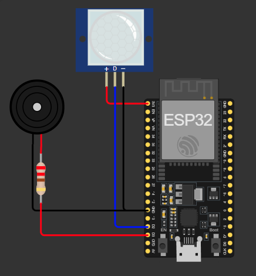

# Sistem Kamera Dummy dengan Deteksi Gerak

Proyek ini adalah prototipe sistem keamanan rumah berbasis ESP32 dan sensor gerak PIR. Ketika mendeteksi gerakan, sistem mengirim notifikasi ke smartphone melalui aplikasi Blynk.

## 🛠 Komponen
- ESP32
- Sensor PIR
- Buzzer

## 🖼️ Gambar Rangkaian



## 🔌 Wiring Diagram
```plaintext
PIR Motion Sensor:
- VCC     → 3.3V (ESP32)
- GND     → GND
- OUT     → Pin 9 (GPIO 9)

Buzzer:
- VCC     → 3.3V (ESP32)
- GND     → GND
- Signal  → Pin 10 (GPIO 10)
```

## 📝 Cara Penggunaan (Simulasi di Wokwi)
1. Jalankan simulasi di Wokwi
2. Sistem akan otomatis tersambung ke jaringan virtual (Wokwi-GUEST) dan menyinkronkan waktu
3. Sensor PIR virtual dapat dipicu secara manual di antarmuka Wokwi
4. Ketika gerakan terdeteksi pada waktu rawan (malam/akhir pekan):
   - Buzzer menyala selama 10 detik
   - Notifikasi virtual dikirim ke Blynk (ditampilkan di log serial & dashboard Blynk)
   - Status alarm tampil di Serial Monitor dan dashboard
5. Matikan alarm secara remote dengan menekan tombol “Alarm” (V1) di dashboard Blynk

## 🎯 Fitur
✅ Simulasi deteksi gerakan menggunakan PIR virtual di Wokwi
✅ Integrasi dengan Blynk Cloud untuk simulasi notifikasi
✅ Alarm hanya aktif saat malam hari (22:00–06:00) atau akhir pekan
✅ Alarm bisa dimatikan secara otomatis atau melalui dashboard Blynk
✅ Logika waktu berbasis NTP (Network Time Protocol) untuk sinkronisasi real-time
